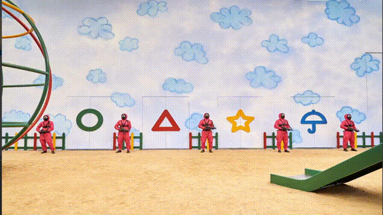

# Shape Detection
It's a shape detection project with OpenCV and Python.

## Setup

- `pip install opencv-python` for doing AI things.
- `pip install simpleaudio` for playing sound effects
- Run `main.py`

## Requirements

- OpenCV
- Simple Audio
- Python 3

